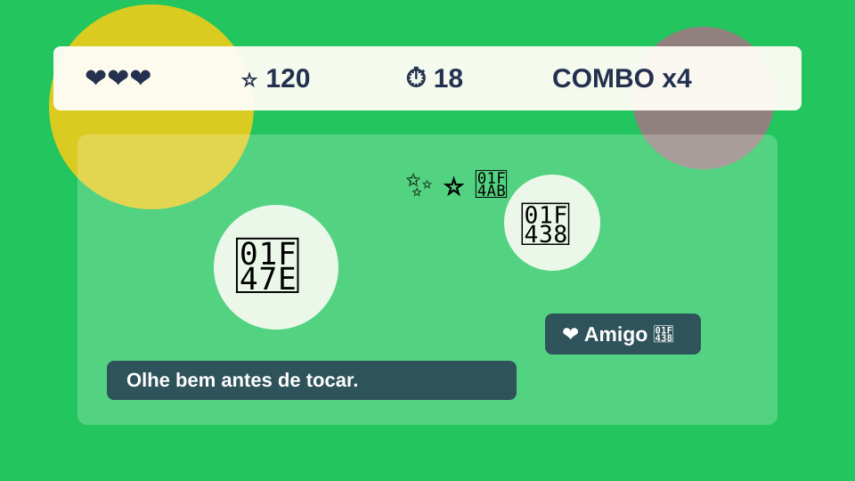

# Pegue o Monstrinho



Um pequeno jogo educativo feito com HTML, CSS e JavaScript puro para ensinar programacao para criancas de aproximadamente 8 anos.

O projeto mistura diversao e aprendizado: cada fase apresenta uma regra nova do jogo e tambem aponta para um conceito de programacao, como eventos, variaveis, funcoes, arrays, objetos, animacoes, sons e `localStorage`.

## Como executar

Inicie um servidor local na pasta do projeto:

```bash
npm start
```

Depois abra:

```text
http://127.0.0.1:4173/
```

Para rodar os testes das regras do jogo:

```bash
npm test
```

Nao e preciso instalar bibliotecas externas.

## Objetivos

- Ensinar programacao passo a passo.
- Manter o codigo simples, modular e comentado.
- Criar uma experiencia divertida em computador, tablet e celular.
- Mostrar como um jogo real pode ser construido com tecnologias basicas da web.

## Tecnologias

- HTML
- CSS
- JavaScript puro
- `localStorage`
- Testes com o executor nativo do Node.js

## Recursos do jogo

- Menu inicial com jogar, personagem, configuracoes, recordes e como jogar.
- Fases progressivas com mais monstros, velocidade maior, monstros menores e chefao.
- Sistema de vidas e Game Over.
- Cronometro de 30 segundos por fase.
- Recorde salvo no navegador.
- Medalhas por pontuacao.
- Explosoes com CSS, sem Canvas.
- Sons centralizados em `js/sounds.js`.
- Cursores infantis por emoji.
- Fundos diferentes por fase.

## Estrutura

```text
child-project
├── index.html
├── css
│   └── style.css
├── js
│   ├── game.js
│   ├── monster.js
│   ├── player.js
│   ├── ui.js
│   └── sounds.js
├── assets
│   ├── images
│   ├── sounds
│   ├── cursors
│   └── backgrounds
├── aulas
│   ├── aula-01.md
│   ├── aula-02.md
│   └── ...
├── tests
│   └── game-rules.test.js
└── README.md
```

## Como contribuir

1. Escolha uma melhoria pequena.
2. Leia a aula relacionada ao tema.
3. Altere apenas os arquivos necessarios.
4. Rode `npm test`.
5. Faca um commit com uma mensagem clara.

Boas ideias para comecar:

- Adicionar uma nova fase.
- Criar mais medalhas.
- Melhorar os sons.
- Desenhar novos fundos.
- Criar exercicios extras nas aulas.
